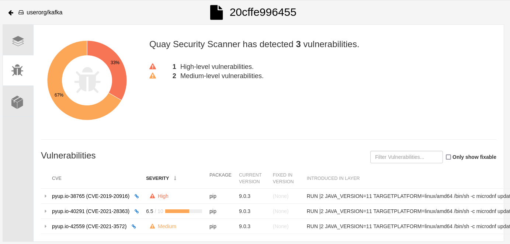
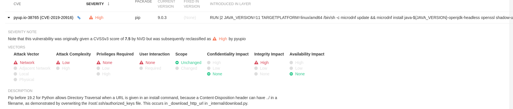
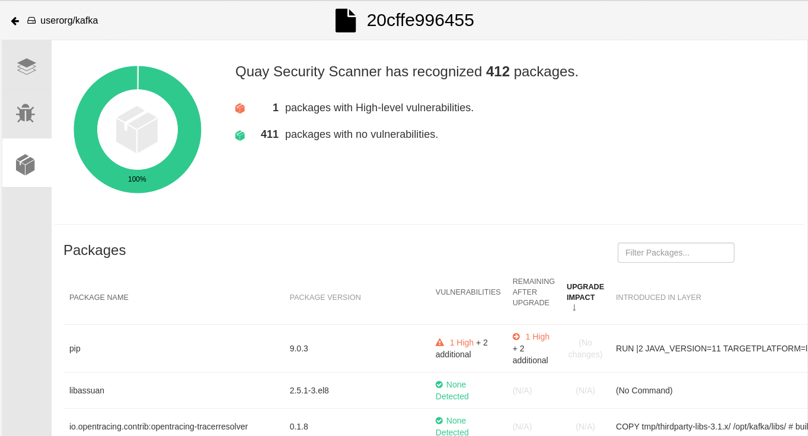

# Clair Security Scanning

Quay includes an integration with Clair to perform vulnerability scanning of container images associated with a set of Linux operating systems.

## Explore the vulnerability data (CVE's)

### Security Scan

1. Navigate to our `kafka` demo Quay repository created [previously](../quay-repository/README.md).

2. Click on the `Security Scan` icon. We should see the Quay Security Scanner Dashboard.

CVE detailed description:

### Packages

1. Click on the `Packages` icon. We should see the Quay Security Scanner Packages Dashboard.

