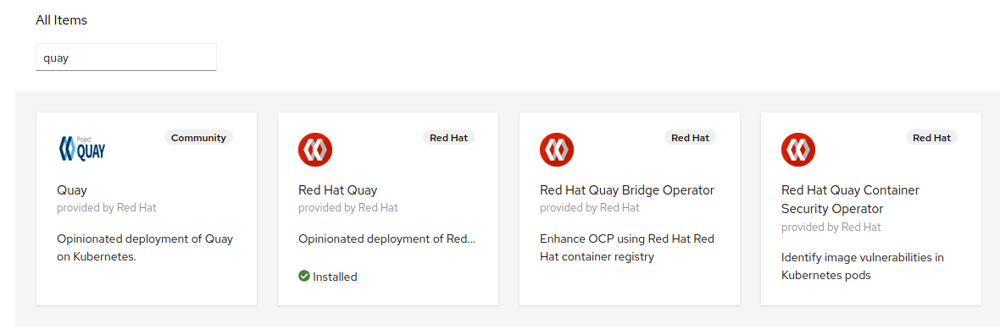
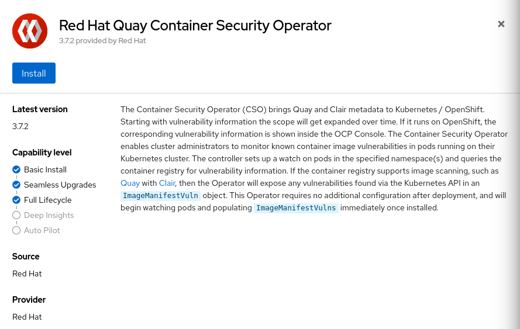
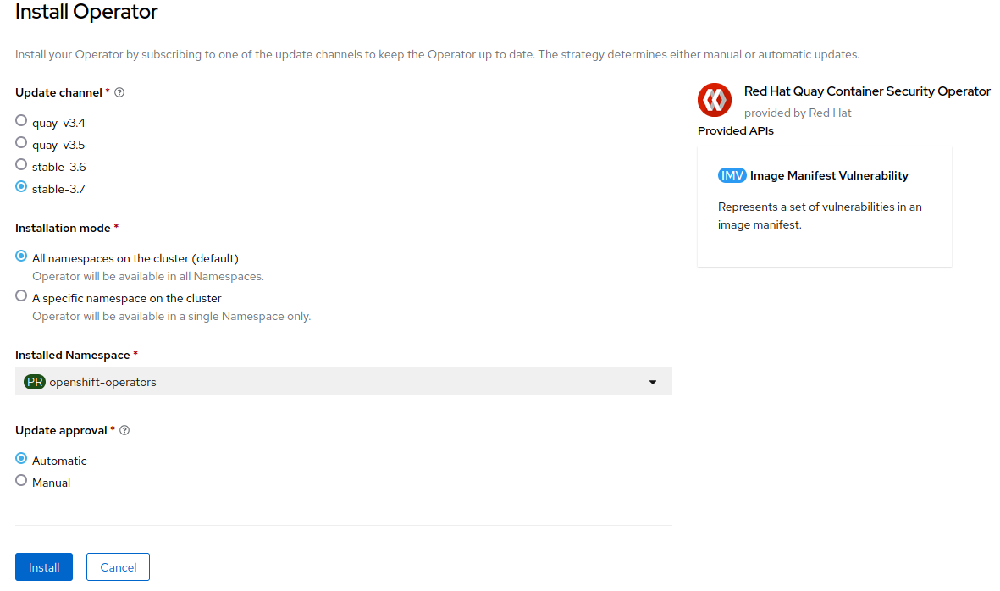

# Scan pod images with the Quay Container Security Operator (CSO)

## Install the Quay CSO Operator

1. Open a browser window and log in to the OpenShift Container Platform web console.

2. From the Administrator perspective, click Operators → OperatorHub.

3. In the Filter by keyword field, type Quay. 

4. Select the Red Hat Quay Container Security Operator tile and click Install.

5. Select `stable-3.7` from the list of available Update Channel options. Choose `All namespaces on the cluster (default)` as installation mode. Choose `Automatic` update approval.

6. Install.

