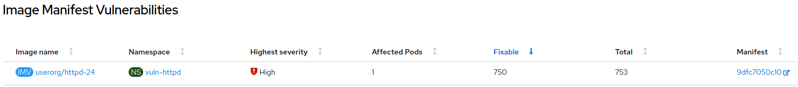

# Scan pod images with the Quay Container Security Operator (CSO)

The Container Security Operator (CSO) brings Quay and Clair metadata to Kubernetes / OpenShift.

## Install the Quay CSO Operator

1. Open a browser window and log in to the OpenShift Container Platform web console.

2. From the Administrator perspective, click Operators → OperatorHub.

3. In the Filter by keyword field, type Quay. 


4. Select the Red Hat Quay Container Security Operator tile and click Install.


5. Select `stable-3.7` from the list of available Update Channel options. Choose `All namespaces on the cluster (default)` as installation mode. Choose `Automatic` update approval.


6. Install.

## Checking the image vulnerabilities through the OpenShift web console

1. Deploy a vulnerable image. For this example, we are going to deploy an old httpd vulnerable image.

```sh
# Pull the image
podman pull registry.redhat.io/rhel8/httpd-24:1-30

# Tag the image
podman tag registry.redhat.io/rhel8/httpd-24:1-30 [quayregistry-cr-name]-quay-[ocp-namespace].[ocp-domain-name]/userorg/httpd-24:1-30

# Push it to our Quay registry
podman push [quayregistry-cr-name]-quay-[ocp-namespace].[ocp-domain-name]/userorg/httpd-24:1-30
```

2. Navigate to the Quay Registry Endpoint and select the `userorg/httpd-24` repository that has been created automatically when we pulled the image before.


3. Select `Settings` and `Make Public`.

4. Open the OpenShift Container Platform web console and create a new project, click Projects → Create Project. Name the project as `vuln-httpd`. Click on `Create`.


5. Deploy the vulnerable image, click Workloads → Deployments. Click on `Create Deployment`.

6. Replace the default image value by the image of our Quay registry. Set replicas as desired. Set `httpd` as custom name.

7. Click on `Create`.

8. OpenShift will start the deployment and will create the pod. Go to Workloads → Pods and select one of the `httpd` pods. Select the `Vulnerabilities` tab.


9. Click con the security scan results.


Additionally, after installing the CSO operator, a new status related to Image Vulnerabilities is shown on the cluster overview.


1. Click on `Image Vulnerabilities`.


2. Click on `View all` and click on the Manifest related to `userorg/httpd-24`.



We will be redirected to the Quay Security Scanner Dashboard.


