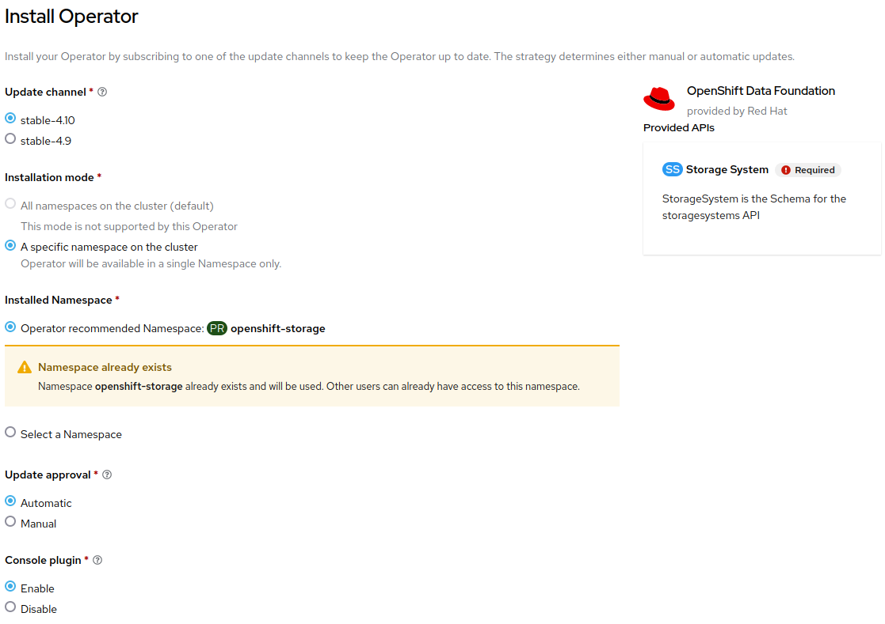
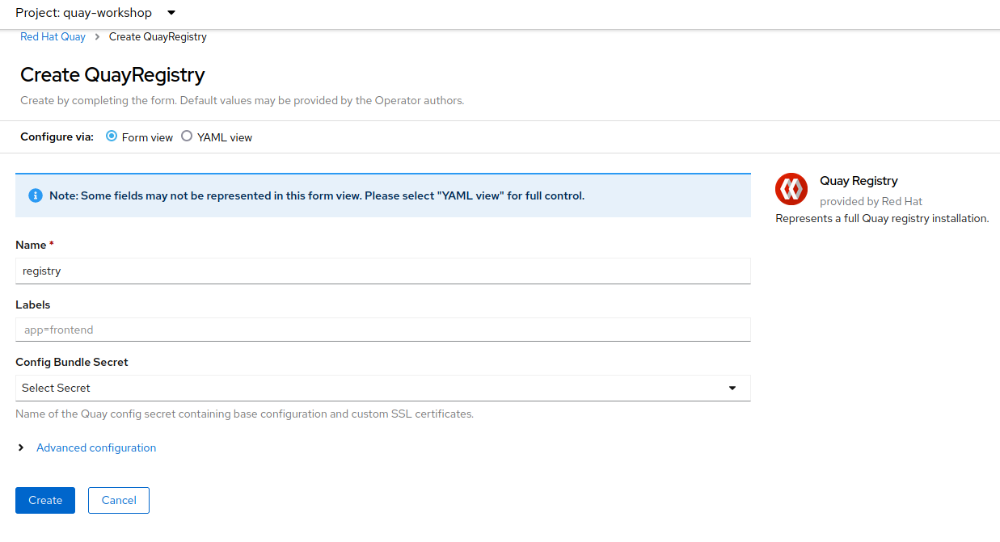

# Quay Installation

OCP version:  4.10.18
Quay version: 3.7
ODF version:  4.10

## Quay Operator Installation

### Quay prerequisites

#### Installing the ODF Operator

You can use the OpenShift Container Platform web console to install Quay prerequisites.

1. Open a browser window and log in to the OpenShift Container Platform web console.

2. From the Administrator perspective, click Operators → OperatorHub.

3. In the Filter by keyword field, type `ODF`.

4. Select the OpenShift Data Foundation tile and click Install.

5. On the Install Operator page select `stable-4.10` from the list of available Update Channel options. Choose `A specific namespace on the cluster` and leave the default vaule of Installed Namespace as `openshift-storage`. Update approval `Automatic`. Console plugin `Enable`.

6. Install.

#### Creating the StorageSystem instance

To use the ODF Operator a StorageSystem instance is required. This is an example for an OCP standard and fresh installation (RHPDS) and may vary depending on your environment.

1. From the Administrator perspective, click Operators → Installed Operators.

2. Select `openshift-storage` project and OpenShift Data Foundation.

3. Click on `Create StorageSystem` button.

4. On the Create StorageSystem select `Use an existing StorageClass` and the `gp2` storage class. Click Next.

5. Select the capacity and the nodes. The selected nodes will be labeled with `cluster.ocs.openshift.io/openshift-storage=""`. Click Next.

6. Data encryption is not needed for this workshop. Click Next.

7. Click on Create StorageSystem.

### Installing Quay Operator using the web console

You can use the OpenShift Container Platform web console to suscribe and deploy the `Red Hat Quay Operator`.

1. Open a browser window and log in to the OpenShift Container Platform web console.

2. From the Administrator perspective, click Operators → OperatorHub.

3. In the Filter by keyword field, type Red Hat Quay.

4. Select the Red Hat Quay tile and click Install.

5. On the Install Operator page select `stable-3.7` from the list of available Update Channel options. Choose `All namespaces on the cluster (default)` as installation mode. Choose `Automatic` update approval.

6. Install.

### Deploying Quay

1. Create a `quay-workshop` project.

2. From the Administrator perspective, click Operators → Installed Operators. Project: `quay-workshop`. Select Red Hat Quay operator.

3. Click on Create instance (Quay Registry).

4. Change the Name if desired. Click on Create.

### Register a new user

1. From the Administrator perspective, click Operators → Installed Operators. Project: `quay-workshop`. Select Red Hat Quay operator.

2. Select Quay Registry tab and click on the recenlty created registry.

3. Open the Registry Endpoint.

4. Create Account.

5. Fill the data, create an account and sign in.

### Troubleshooting

#### The init containers hungs when I try to deploy the Quay registry.

Delete or reconfigure the LimitRange in your project. The demo environment creates it automatically.
