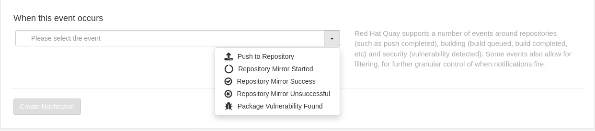

# Quay Repository Notifications

Quay supports adding notifications to a repository for various events that occur in the repository’s lifecycle.



## Create a Push to Repository Event Notification

* From the Red Hat Quay Dashboard, click on `kafka` repository. Recall from [Quay Repository](quay-repository/README.md), we created and pushed a strimzi/kafka image on it.

* Click `Settings`.

* Click `+ Create Notification` button.

* In the `When this event occurs` drop down, select `Push to Repository`.

* Under the `Then issue a notification` drop down, select `Red Hat Quay Notification`.


* In the `Recipient` drop down, select `owners`.

* In the `Notification title` text field, type `A new image has been pushed into the repository`.

* Click `Create Notification`.

Push a new image into the repository or add a new tag the current one.

```sh
podman pull quay.io/strimzi/kafka:latest-kafka-3.0.0
podman tag quay.io/strimzi/kafka:latest-kafka-3.0.0 [quayregistry-cr-name]-quay-[ocp-namespace].[ocp-domain-name]/userorg/kafka:3.0.0
podman login [quayregistry-cr-name]-quay-[ocp-namespace].[ocp-domain-name]
podman push [quayregistry-cr-name]-quay-[ocp-namespace].[ocp-domain-name]/userorg/kafka:3.0.0
```

After a while, we will see the notification in the top of our dashboard.


