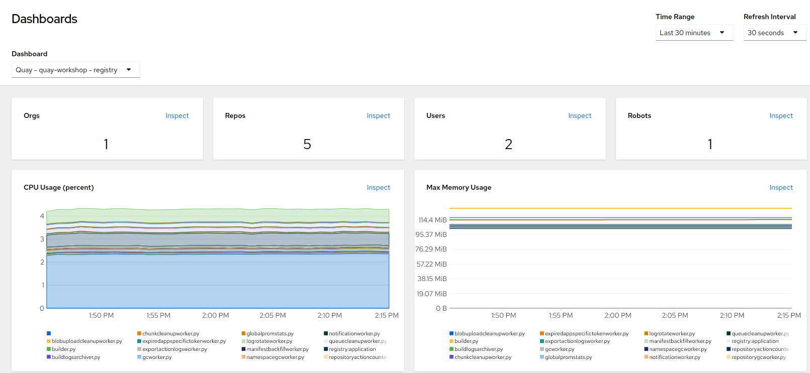
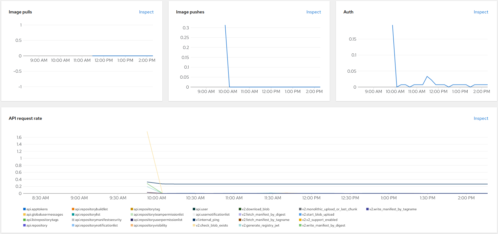

# Quay Observability

OpenShift provides an onboard observability. The Quay Operator adds an embedded/integrated Quay Dashboard into the graphical OpenShift console; there is where we can observe the healthiness, rates, latency and more of our Quay registry.

1. Open a browser window and log in to the OpenShift Container Platform web console.

2. From the Administrator perspective, click Observe → Dashboards.

3. In the `Dashboard` drop down, select `Quay - quay-workshop - registry`.

