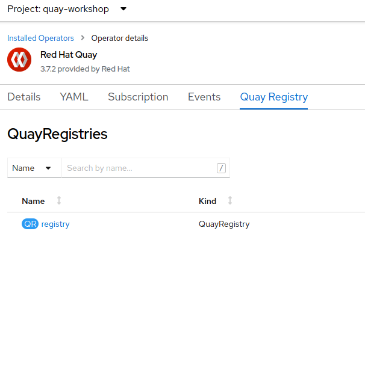
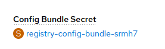
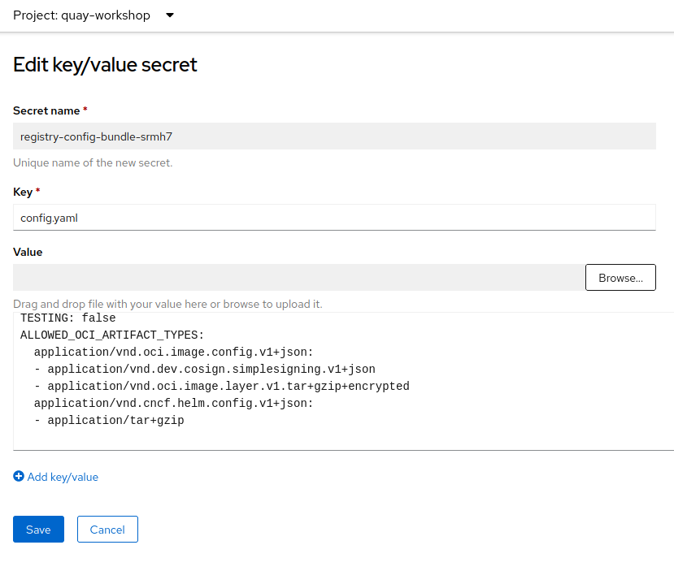
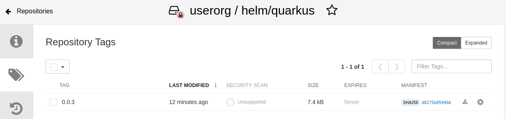
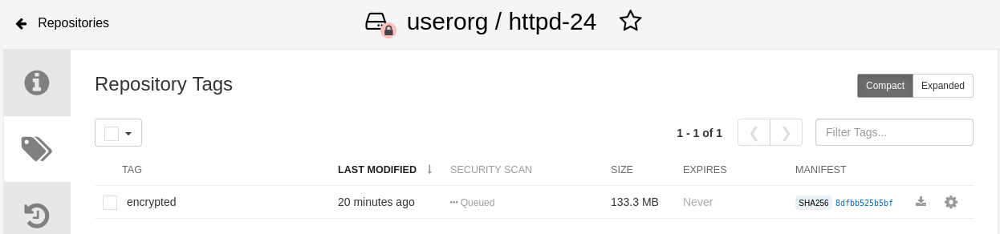

## OCI-based Artifacts Repository

Quay can be used to store OCI-based artifacts like Helm charts, encrypted container images, signed images, zstd compressed images, etc. 

## Configuring Allowed OCI Artifact Types

Some of the oci artifats that we are going to use on the next sections are not allowed by default. For example, the Helm charts are allowed by default, but the encrypted container images not (at least at the time of this writing).

As a previous step, we are going to configure the ALLOWED_OCI_ARTIFACT_TYPES environment variable for allowing some of the oci artifacts that we will use soon.

1. Open a browser window and log in to the OpenShift Container Platform web console.

2. Click Operators → Installed Operators.

3. Select `quay-workshop` as the project and click on `Quay Registry`. Click to our `registry`.



4. Click on the `Config Bundle Secret` secret (`registry-config-bundle-*`).



5. In the `Actions` drop down, select `Edit Secret`.

6. Add the following into the `Value` text field. And click `Save`.

```yaml
ALLOWED_OCI_ARTIFACT_TYPES:
  application/vnd.oci.image.config.v1+json:
  - application/vnd.dev.cosign.simplesigning.v1+json
  - application/vnd.oci.image.layer.v1.tar+gzip+encrypted
  application/vnd.cncf.helm.config.v1+json:
  - application/tar+gzip
```



The `registry-quay-config-editor-*` and `registry-quay-app-*` pods will be restarted automatically with the new configuration.

## Helm Charts

1. Login to Quay registry with helm.

```sh
helm registry login <QUAY_HOSTNAME>
```

2. Pull a chart.

```sh
helm pull https://redhat-developer.github.io/redhat-helm-charts/charts/quarkus-0.0.3.tgz
```

3. Push the chart into Quay repository.

```sh
helm push quarkus-0.0.3.tgz oci://<QUAY_HOSTNAME>/userorg/helm
```

4. Open the Quay Dashboard and open the `userorg/helm/quarkus` and go to `Tags`.



The Helm chart is published to Quay as an OCI image.

5. The Helm chart can be installed directly from the repository.

```sh
helm install quarkus oci://<QUAY_HOSTNAME>/userorg/helm/quarkus --version=0.0.3
```

## Encrypted Container Images

An image can be encrypted with a key or multiple keys. Also, we can encrypt the full image layers or some specific layer instead; also, we can encrypt all image layers or only some layer. In any case, we can store the container image into Quay.

1. Generate the encryption RSA keys with openssl.

```sh
# private key
openssl genrsa --out /tmp/private-key.pem 2048

# public key
openssl rsa -in /tmp/private-key.pem -pubout -out /tmp/public-key.pem
```

2. Copy the image that we want to encrypt.

```sh
skopeo copy docker://quay.io/centos7/httpd-24-centos7:latest oci:/tmp/local-httpd24:latest
```

3. Encrypt the image.

```sh
skopeo copy --encryption-key jwe:/tmp/public-key.pem oci:/tmp/local-httpd24:latest oci:/tmp/local-httpd24-encrypted:latest
```

4. Push the image to Quay.

```sh
skopeo copy oci:/tmp/local-httpd24-encrypted:latest docker://<QUAY_HOSTNAME>/userorg/httpd-24:encrypted
```

5. Navigate to the Quay Registry Dashboard, `userorg/httpd-24` repository.

6. Click `Tags`.

We will see our encrypted image stored in it.


