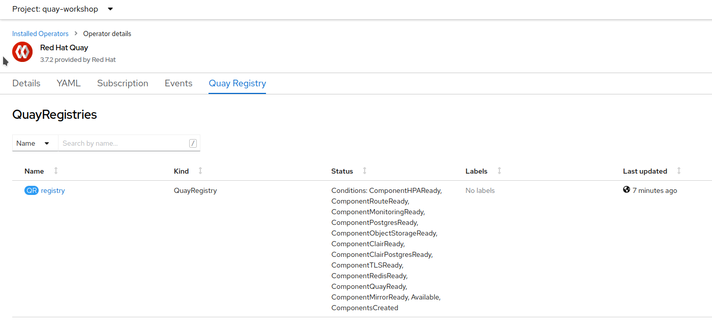
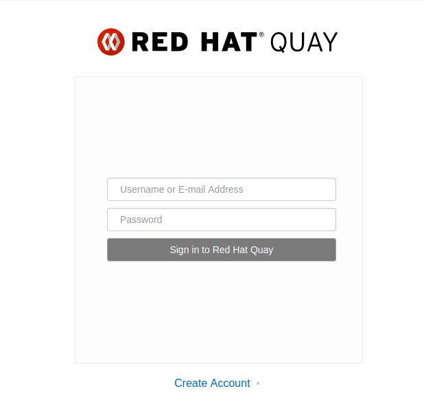

# Users and Organizations in Red Hat Quay

## Creating user accounts

To create a new user for our Red Hat Quay instance:

1. Open a browser window and log in to the OpenShift Container Platform web console.

2. From the Administrator perspective, click Operators → Installed Operators. Project: `quay-workshop`. Select Red Hat Quay operator.

3. Select Quay Registry tab and click on the recenlty created registry.

4. Open the Registry Endpoint.

5. Create Account.

6. Fill the data, create an account and sign in.

## Creating Organization accounts

The organization allows sharing repositories of container images. To create a new organization:

1. While logged in, click `Create New Organization`.

2. Type the name of the organization. Click `Create Organization`.

