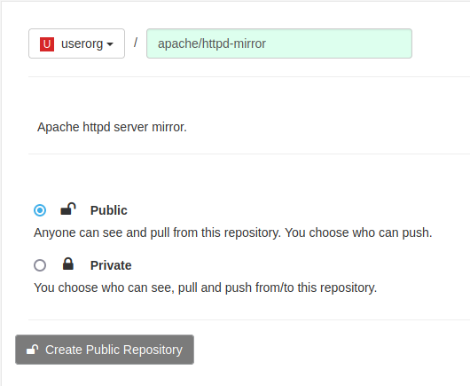
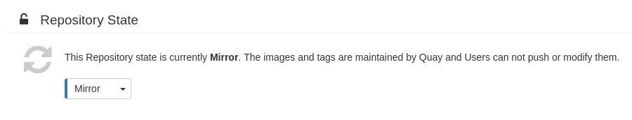
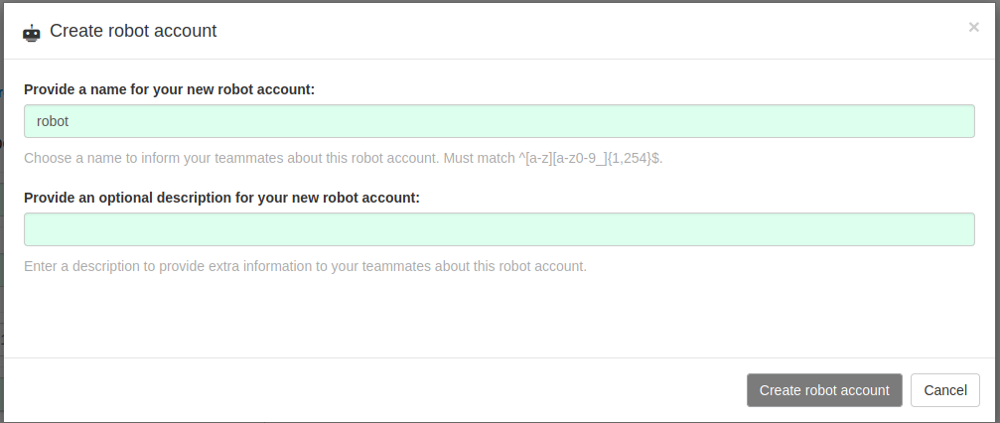
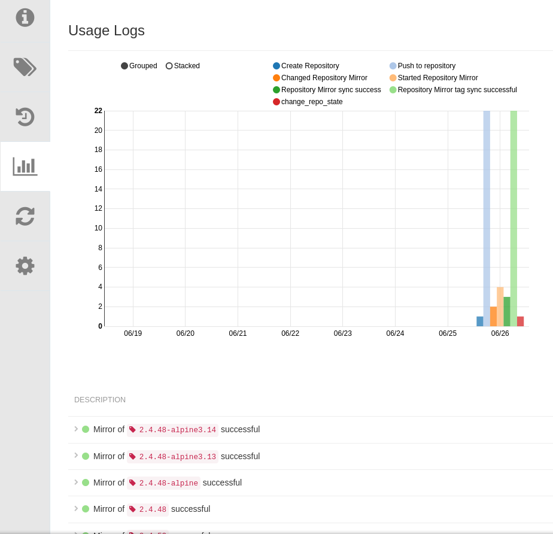
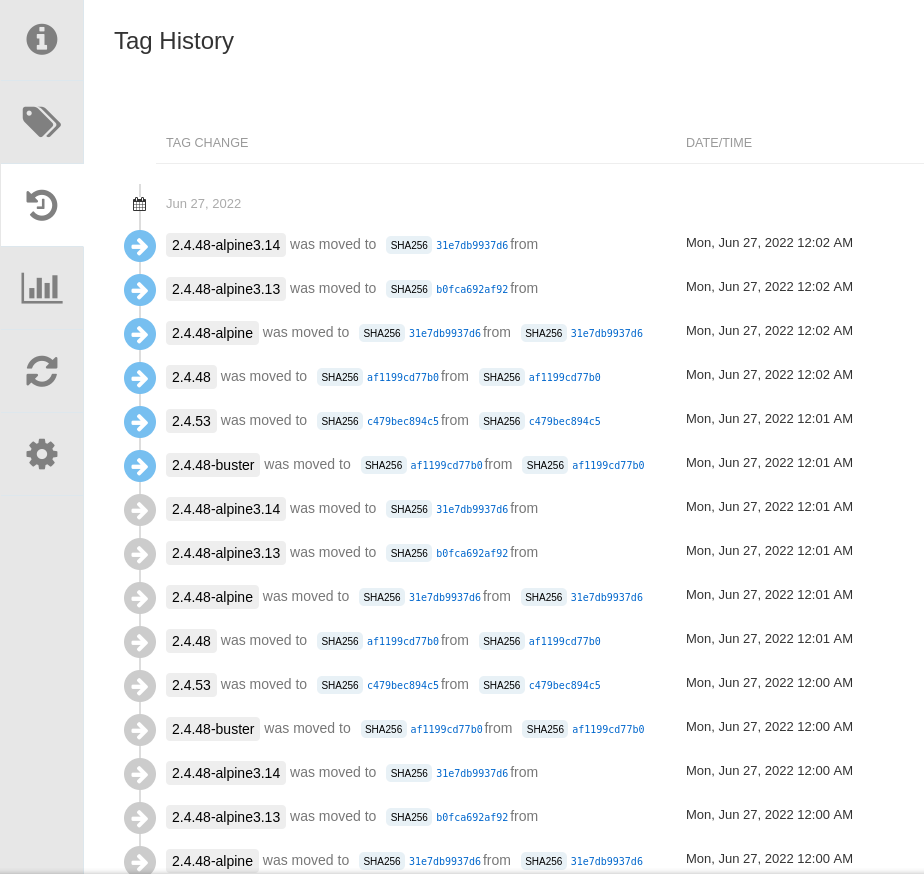
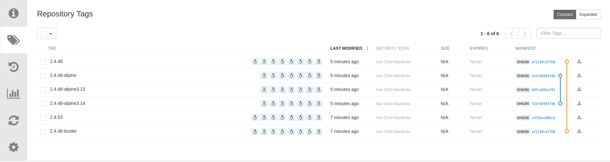

# Quay Repository Mirroring

Quay Repository mirroring lets us mirror images from external container registries (or local) into our Quay cluster.

## Create a repository to mirror from

1. Click `Create New Repostory`.

2. Select the organization in the drop down list, name the repository `apache/httpd-mirror` and set `Public` visibility.

3. Click `Create Public Repository`.

4. Click the `Settings` icon.

5. Change the `Repository State` to `Mirror`.

6. Click the `Mirroring` icon.

7. Fill out the fields with the following values:

* Registry Location: `httpd`
* Tags: `2.4.53, 2.4.48*`
* Start Date: set the current date/time
* Sync Interval: `1 minute`
* Robot User: `Create robot account`

Click on `Create robot account`.

8. Click on `Enable Mirror`.

### Repository Usage Logs, Tags and Tag History

After enabling the mirror, check the Tag History, Tags and Usage Logs as shown below.

## Check also

[Repository mirroring versus geo-replication](https://access.redhat.com/documentation/en-us/red_hat_quay/3.7/html/manage_red_hat_quay/repo-mirroring-in-red-hat-quay#mirroring-versus-georepl)
