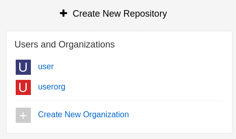
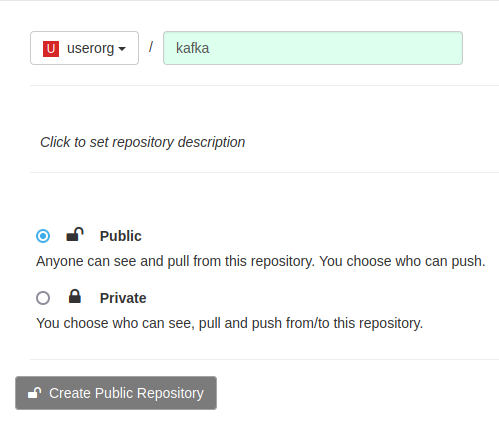
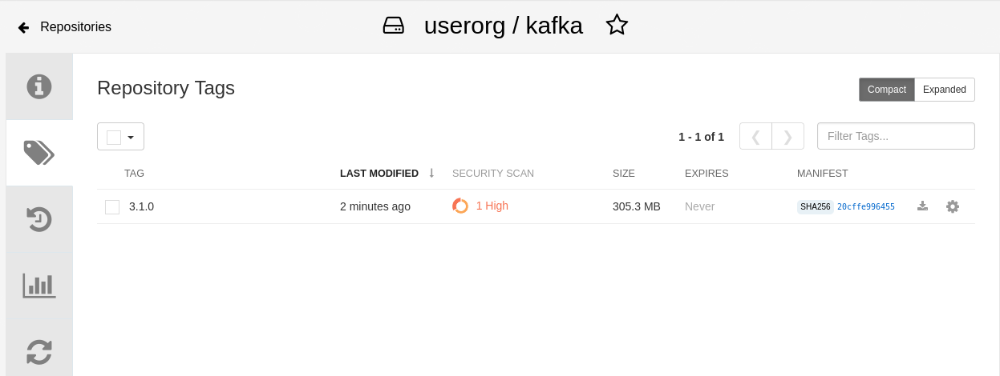
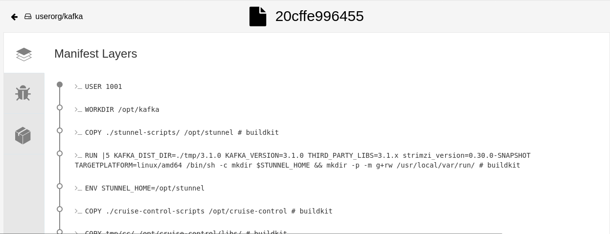

# Quay Repositories

## Creating an image repository

1. Click `Create New Repostory`.



2. Select the organization in the drop down list, name the repository `kafka` and set `Public` visibility.



3. Click `Create Public Repository`.

## Push an image into the repository

1. Pull an image from the public registry.

```sh
podman pull quay.io/strimzi/kafka:latest-kafka-3.1.0
```

2. Tag the image.

```sh
podman tag quay.io/strimzi/kafka:latest-kafka-3.1.0 [quayregistry-cr-name]-quay-[ocp-namespace].[ocp-domain-name]/userorg/kafka:3.1.0
```

3. Sign into our Quay.

```sh
podman login [quayregistry-cr-name]-quay-[ocp-namespace].[ocp-domain-name]
```

3. Push the image to Quay repository.

```sh
podman push [quayregistry-cr-name]-quay-[ocp-namespace].[ocp-domain-name]/userorg/kafka:3.1.0
```

4. Check that the image has been pushed into our Quay repository.



## Inspecting image layers

1. Navigate to the `userorg/kafka` repository.

2. Click the `Tags`icon.

3. We should have the 3.1.0 tag. Under `MANIFEST`, click on the `SHA256` value `20cffe996455`. We will see the layers dashboard.



