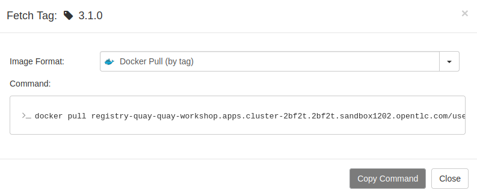

# Quay Repositories

## Creating an image repository

1. Click `Create New Repository`.


2. Select the organization in the drop down list, name the repository `kafka` and set `Public` visibility.


3. Click `Create Public Repository`.

## Push (and Tag) an image into the repository

1. Pull an image from the public registry.

```sh
podman pull quay.io/strimzi/kafka:latest-kafka-3.1.0
```

2. Tag the image.

```sh
podman tag quay.io/strimzi/kafka:latest-kafka-3.1.0 <QUAY_HOSTNAME>/userorg/kafka:3.1.0
```

3. Sign into our Quay.

```sh
podman login <QUAY_HOSTNAME>
```

4. Push the image to Quay repository.

```sh
podman push <QUAY_HOSTNAME>/userorg/kafka:3.1.0
```

5. Check that the image has been pushed into our Quay repository.


## Inspecting image layers

1. Navigate to the `userorg/kafka` repository.

2. Click the `Tags`icon.

3. We should have the 3.1.0 tag. Under `MANIFEST`, click on the `SHA256` value `20cffe996455`. We will see the layers dashboard.


## Pull an image from the repository

1. From Quay dashboard, click on `userorg/kafka` repository.

2. Click `Tags`.

3. On any of the tags, click the `Fetch Tag` icon.

4. Select `Docker Pull (by tag)` from the `Image Format` drop down and click the `Copy Command` button.



5. Switch to a terminal, paste and execute the command on it. Docker or podman is required. If we're using podman, we have to replace the `docker` with `podman` before execute the command.
